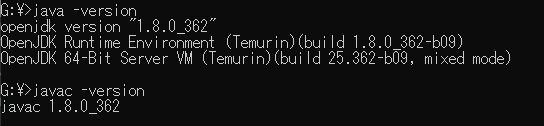
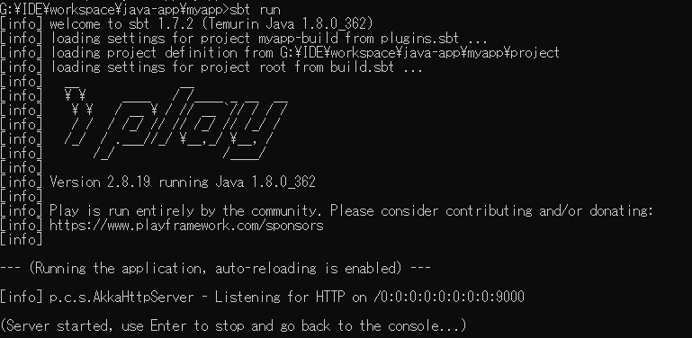
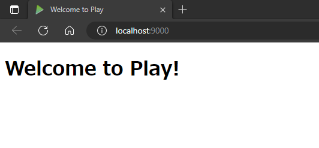

# 橋田java案件IN予定のため再勉強PJです。（Java+PlayFrameWork）

## 環境構築

### 前提条件
- Eclipseがインストールされていること
- JDK8がインストールされていること


### 手順
- sbtのDL/Inst
  - [DLサイト](https://www.scala-sbt.org/download.html)
    - 備忘録：sbt-1.8.2.msi

- EclipseでPJのクローン

- cmdで下記実行
  - ``` cd [PJルート（myapp直下） ```
  - ``` sbt run ```
    

- ローカルホストにアクセス
  - [localhost:9000](http://localhost:9000)
  - 

### [備忘録]PJ作成時のみ（クローンする場合は不要）
- プロジェクトの作成
  - cmdで下記実行
    - ``` cd [PJルート（myapp直下） ```
    - ``` sbt new playframework/play-java-seed.g8 ```

### その他
- [githubのpush時にこけたら](https://boukenki.info/eclipse-git-push-cant-connect-to-any-repository-%E6%9C%AA%E8%AA%8D%E8%A8%BC/)

## 参考サイト
- [公式](https://www.playframework.com/documentation/ja/2.4.x/IDE)
- [その他](https://tasotasoso.hatenablog.com/entry/2019/04/26/004614)